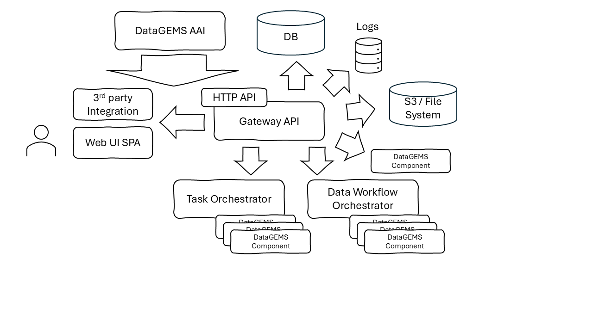

# Service Architecture

The Gateway API service offers an entrypoint to the platform functionality for integrating services as well as the platform's user interface. It manages edge authentication and authorization while also performing model aggregations and transformations were needed. It provides a uniform view over the DataGEMS functionality, composing and masking underpinning service offerings and APIs.

A general architecural view of the service is presented in the following diagram:

The Gateway API relied on the [DataGEMS AAI](https://datagems-eosc.github.io/dg-aai) to propvide central authentication for the callers (end users and integrating services). The AAI endpoints are used both the authenticate external endpoint requests as well as to authorize the reqeusted actions. Additionally, the AAI endpoints are used to retrieve access tokens for the Gateway API's requests to other DataGEMS components, generating new tokens or exchanging request toekns for ones that can be used to forward processing to underpinning services. Thes supported flows and access level processing is presented in the respective [Security](security.md) sections.

During its operation, the service generates troubleshooting logs made available to the [Logging Service](https://datagems-eosc.github.io/dg-logging). The same flow that generated and aggregates troubleshooting logs includes also accounting events that are harvested for the Gateway by the [Accounting Service](https://datagems-eosc.github.io/dg-accounting).

For the operational data that are managed by the Gateway, a ralational database [Datastore](datastore.md) supports the Gateway's operations. It acts supplementary to the data managed by the rest of the DataGEMS data components and its primary use is to facilitate user experience and supportive flows. Similarly, access to the filesystem structure and S3 storage is available to facilitate data uploading and downloading.

Underpinning DataGEMS services are integrated with the Gategeway API through their HTTP endpoints. The primary integration targets are:

* [Data Workflow Orchestrator](https://datagems-eosc.github.io/dg-data-workflow) - This integration handles data management flows, including dataset onboarding, profiling, maintenance tasks, etc
* [Task Orchestrator](https://datagems-eosc.github.io/data-model-management) - This integration handles requests for data discovery and analysis

Additional integrations are available with explicit DataGEMS componenents. Although the primary flows for the platform are handled by the Data Workflow and Task Orchestrators, there are cases where the Gateway API needs to contact explicitly with one of the underlying components.